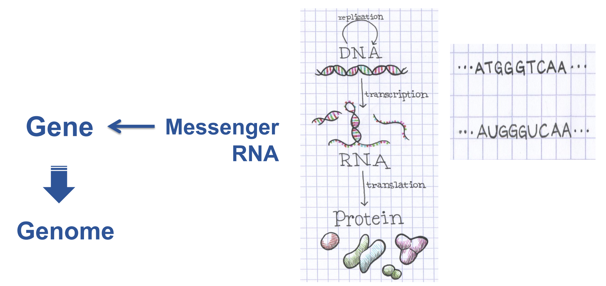
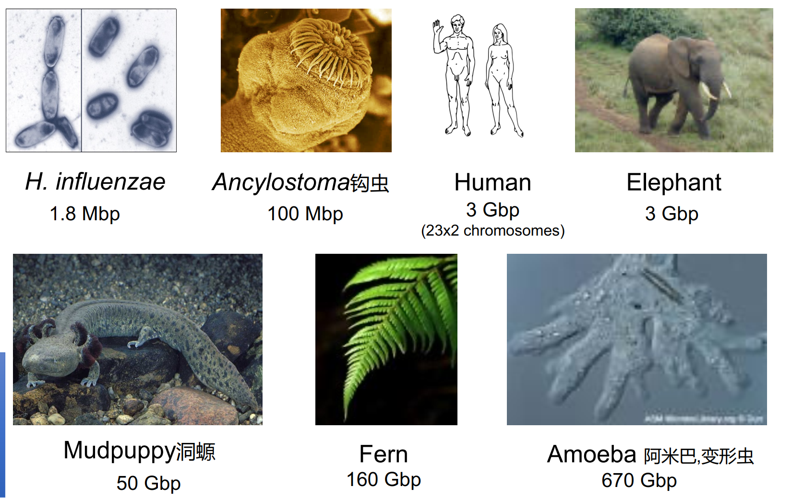
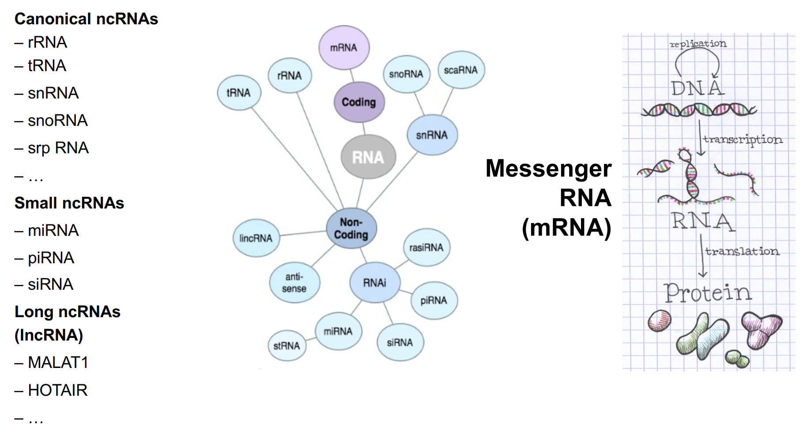

# **Bioinformatics** @ Tsinghua University, 2023

## Week 1

### Syllabus

- Programming Skills
- NGS Data Analysis
- Machine Learning
  
Scoring: Hw 90% Sharing 10%

### Part I

#### Gene: Coding & Noncoding

[Gene](https://en.wikipedia.org/wiki/Gene) is an **abstract** concept, referring to some sort of information encoded in our bodies at a molecular level.  

[Genome](https://en.wikipedia.org/wiki/Genome) is

> all the genetic information of an organism.

* The size of genome **DOES NOT** necessarily correspond to the complexity of a specific creature.

* Humans have a high percentage of DNA not coding for proteins.

* A lot of types of different DNAs, especially Noncoding ones:

* Sequencing Technology: a competition between Celera and 

*Three Steps of Bioinformatics*

1. Information
2. Model
3. Algorithm

The difference of Model and Algorithm:

A typical machine learning task involves: 
- Training data 
- Hypothesis space
- Learning Algorithm

The model is strongly related to the prior inductive bias of the hypothesis space. We may want the space to be smooth, differentiable, and simple, so our result is restricted to those statements. 

The algorithm, in this sense, is a method of reaching a *good* solution to the problem. Famous ones include: (Stochastic) Gradient Descent, Dynamic Programming, Monte Carlo, etc.

Commonly, it is harder to develop a new algorithm than to devise a new model.

**Screenshots of slides credit to Bioinformatics, Zhi J. Lu, Tsinghua, 2023.**

## Study Plan

Since I am a student majoring in Electrical Engineering, I am to some extent familiar to Linux, Latex, Markdown, Python and Pytorch, etc. So in this semester, I plan to focus a bit more on the biological background and biological meanings of the technologies of bioinformatics. 

Also, I am now conducting experiments on a Single-Cell Sequencing and RNA Velocity project, but I am only familiar with the data processing, which I reckon is not enough to get a thorough view of the field.

My current plan is listed as below.

- [ ]  Read papers about the backgrounds of single-cell sequencing and rna velocity along with the process of the project.
- [ ]  Take notes in classes, review and learn new commands, usages of new packages after class.
- [ ]  Keep a track for github contribution.
- [ ]  Read through the extra materials about coding and the basics of biology.
- [ ]  Ask Prof. Zhi J. Lu about the materials about the basics of biology and quickly go through them.
- [ ]  Try to apply different machine learning algorithms to further practice data processing.